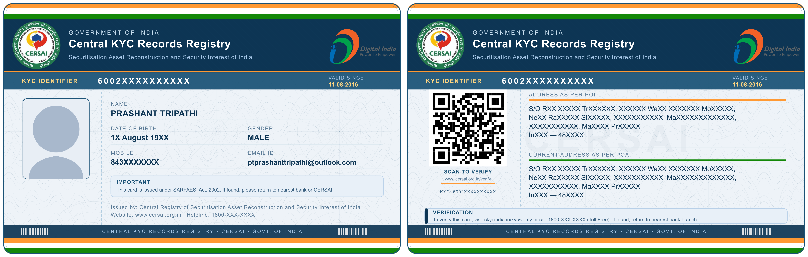

# CKYC Card Redesign Proposal — CERSAI

> An independent, voluntary redesign proposal for the Central KYC Records
> Registry (CKYC) card issued by CERSAI, Government of India.

<p align="center">
  
</p>

<p align="center">
  <a href="https://creativecommons.org/licenses/by/4.0/">
    
  </a>
  
  
  
</p>

---

## Overview

This repository contains a voluntary redesign proposal for the **Central KYC
(CKYC) card** issued by the **Central Registry of Securitisation Asset
Reconstruction and Security Interest of India (CERSAI)** under the SARFAESI
Act, 2002.

The proposal was created independently, without any commission or affiliation
with CERSAI, to demonstrate how the existing CKYC card design could be improved
to match the visual quality, usability, and security standards seen in other
major Indian identity documents.

**Live preview:**
[https://ptprashanttripathi.github.io/ckyc-card-redesign-proposal](https://ptprashanttripathi.github.io/ckyc-card-redesign-proposal)

---

## Motivation

India has made remarkable strides in digital identity infrastructure. Documents
like the **Aadhaar Card**, **PAN Card**, **Driving Licence**, and **Voter ID
Card** are recognised globally for their consistent layout, clear information
hierarchy, and security features.

The current CKYC card, while functionally sound, does not yet reflect the same
level of visual polish and citizen-centric design. As a technology enthusiast
and open-source contributor, I felt there was an opportunity to contribute
something useful — not for monetary gain, but in the spirit of improving the
citizen experience.

This proposal is offered respectfully and constructively to CERSAI and the
Government of India.

---

## Design Goals

| Goal                     | Description                                                                                                   |
| ------------------------ | ------------------------------------------------------------------------------------------------------------- |
| **Visual hierarchy**     | Clear distinction between primary (name, KYC ID) and secondary (address, dates) information                   |
| **Readability**          | High-contrast field labels and values; generous spacing; no visual clutter                                    |
| **Security aesthetics**  | Guilloche wave patterns, Ashoka Chakra-inspired watermarks, micro-line backgrounds, barcode security strips   |
| **Indian identity**      | Tricolor strips (saffron, white, green) anchored within rounded card boundaries; deep navy government palette |
| **Typography & spacing** | Clean type scale, rounded corners, grid-aligned fields — consistent with Aadhaar and PAN card conventions     |
| **Two-sided design**     | Front holds identity fields; back holds address, QR verification, and legal information                       |
| **Editable SVG**         | All text fields are plain SVG `<text>` elements — easy to update programmatically or in any vector editor     |

---

## File Structure

```
ckyc-card-redesign-proposal/
├── .github/
│   └── workflows/
│       └── deploy.yml      # GitHub Actions — auto-deploy to GitHub Pages
├── assets/
│   └── images/
│       ├── logo.png                 # CERSAI official logo
│       └── existing-ckyc-card.png  # Current CKYC card (reference)
├── cards/
│   ├── ckyc_card_front.svg           # Proposed front side of the CKYC card
│   └── ckyc_card_back.svg            # Proposed back side of the CKYC card
├── index.html              # Presentation page for GitHub Pages
├── package.json            # pnpm formatter (prettier + @prettier/plugin-xml)
├── README.md               # This file
└── LICENSE                 # CC BY 4.0
```

---

## Card Preview

<p align="center">
  
</p>

### Proposed Front Side

**Front side contains:**

- Government of India header with CERSAI logo
- KYC Identifier Number (prominent, high-contrast banner)
- Full name, Date of Birth, Gender
- Mobile number and Email ID
- Photo placeholder with security corner brackets
- Saffron / white / green Tricolor strips (clipped to rounded card boundary)
- Guilloche wave pattern background
- Ashoka Chakra-inspired radial watermark
- Security barcode strip at bottom
- [Digital India logo](https://en.wikipedia.org/wiki/Digital_India#/media/File:Digital_India_logo.svg)
  (MeitY official mark, embedded as SVG)

### Proposed Back Side

**Back side contains:**

- Identical header to front: tricolor strips, CERSAI logo, "GOVERNMENT OF INDIA"
  / "Central KYC Records Registry", Digital India logo, KYC Identifier band
- QR code panel for digital verification (scan-to-verify + KYC number)
- Address as per Proof of Identity (POI)
- Current Address as per Proof of Address (POA)
- Verification helpline and URL
- Identical footer to front: security barcode strip + "CENTRAL KYC RECORDS
  REGISTRY • CERSAI • GOVT. OF INDIA" + tricolor strips
- Ghost CERSAI watermark on body

---

## Design Decisions

### Color Palette

| Color       | Hex       | Usage                                 |
| ----------- | --------- | ------------------------------------- |
| Deep Navy   | `#0d3554` | Header band, security strip, borders  |
| Steel Blue  | `#1a5276` | KYC identifier band, accents          |
| Muted Blue  | `#5a7a96` | Field labels                          |
| Saffron     | `#FF9933` | Tricolor top strip, accent underlines |
| India Green | `#138808` | Tricolor bottom strip                 |
| Warm White  | `#eef3f8` | Card body background                  |
| Gold        | `#ffd580` | KYC identifier value, highlights      |

### Security Elements

- **Guilloche waves** — sinusoidal micro-line pattern across the card body, a
  standard anti-counterfeiting technique used in banknotes and official
  documents
- **Ashoka Chakra watermark** — faint radial spoke pattern inspired by the
  national emblem, providing a recognisable Indian government identity cue
- **Micro-line diagonal fill** — subtle diagonal hatch in header and security
  band
- **Security barcode strip** — alternating vertical bars at the base of both
  sides
- **Corner bracket marks** — security corner markers around the photo zone

### Typography

Designed with a clear three-level hierarchy:

1. **Primary** — Name, KYC ID (14–19px, bold, deep navy)
2. **Secondary** — Field values: DOB, gender, mobile (12–13px, semibold)
3. **Tertiary** — Field labels: uppercase, spaced, muted blue (9px)

---

## Technical Notes

- Format: **SVG 1.1**, valid and editable in any vector editor (Inkscape, Adobe
  Illustrator, Figma, etc.)
- Card size: **85.6 × 54 mm** (ISO/IEC 7810 ID-1 standard — same as Aadhaar,
  PAN, credit cards)
- SVG viewBox: `0 0 680 430` (rendered at `1020 × 645 px` at 1.5× for crisp
  display)
- All background patterns, tricolor strips, and decorative elements are
  **clipped inside the card's rounded rectangle** (`rx="16"`) using
  `<clipPath>`, ensuring no visual bleed beyond the card boundary
- The CERSAI logo is embedded as a base64-encoded `<image>` element for full
  portability
- Photo zone uses a `<clipPath>` for a clean rounded frame, ready to replace
  with an actual `<image>` tag

---

## How to Use

### View locally

```bash
git clone https://github.com/PtPrashantTripathi/ckyc-card-redesign-proposal.git
cd ckyc-card-redesign-proposal
# Open index.html in any modern browser
open index.html
```

### Replace sample data

The SVG files use plain `<text>` elements. Open `cards/ckyc_card_front.svg` or
`cards/ckyc_card_back.svg` in any text editor or vector application and search
for the sample values:

- `MR PRASHANT TRIPATHI` → replace with cardholder name
- `60021142168221` → replace with KYC identifier
- `11 August 1998` → replace with date of birth
- `8435782545` → replace with mobile number
- Photo placeholder → replace `<g clip-path="url(#photo)">` contents with
  `<image href="photo.jpg" .../>`

---

## Attribution

**Original design concept:** Pt. Prashant Tripathi **Email:**
PtPrashantTripathi@outlook.com **GitHub:**
[@PtPrashantTripathi](https://github.com/PtPrashantTripathi)

**Digital India logo** embedded in the card front is the official mark of the
Ministry of Electronics & Information Technology (MeitY), Government of India.
Source:
[Wikipedia — Digital_India_logo.svg](https://en.wikipedia.org/wiki/Digital_India#/media/File:Digital_India_logo.svg)

If you use, adapt, or implement this design, please include the following
attribution:

> _CKYC Card Redesign Concept by Pt. Prashant Tripathi — Licensed under
> [CC BY 4.0](https://creativecommons.org/licenses/by/4.0/)_

---

## License

This work is licensed under the **Creative Commons Attribution 4.0 International
License (CC BY 4.0)**.

You are free to use, share, adapt, and implement this design — including for
commercial and government use — provided appropriate credit is given to the
original creator.

[](https://creativecommons.org/licenses/by/4.0/)

See the [LICENSE](./LICENSE) file for full terms.

---

## Disclaimer

> This is an **independent, voluntary design proposal**. It is not an official
> CERSAI design and has not been commissioned, reviewed, or endorsed by CERSAI,
> the Reserve Bank of India, the Ministry of Finance, or any other government
> authority. The CERSAI name and logo are the property of CERSAI and are used
> here solely for illustrative purposes within the context of this design
> proposal.
>
> The sample personal data shown on the card (name, address, date of birth,
> mobile, email) is the creator's own data, used with explicit personal consent.

---

<p align="center">
  Made with ❤️ for India &nbsp;|&nbsp; जय हिन्द 🇮🇳
</p>
